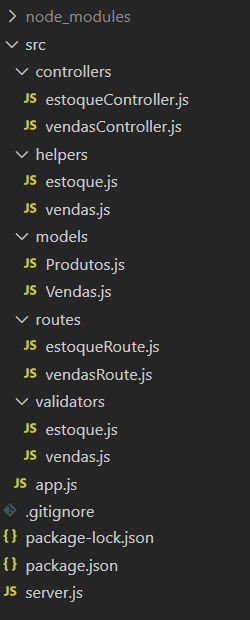

# Controle autônomo

## Sobre o projeto
Essa API tem o intuito de ajudar os microempreendedores que estão iniciando o seu negócio (ou não) ou que possuem equipes reduzidas, facilitando a administração dos produtos que oferecem. O propósito dessa API é fazer o controle de estoque para autônomos que possuem a dificuldade de administrar a saída e entrada das suas mercadorias

Nessa API é possível cadastrar produtos (estoque) e emitir pedidos (vendas). Para uma melhor organização, os registros de Produtos e Vendas, serão armazenados em duas coleções diferentes, utilizando o banco de dados MongoDB. A emissão de cada pedido está relacionada diretamente com o estoque, fazendo a subtração (venda) ou soma (abastecimento ou estorno) na quantidade existente do estoque do produto que será vendido, permitindo sempre uma atualização simultânea da venda com o estoque.

## Estrutura do Projeto



## Dependências requeridas

    "bcrypt": "^5.0.0",
    "express": "^4.17.1",
    "mongoose": "^5.11.1",
    "nodemon": "^2.0.6",
    "yup": "^0.32.1"

## Rotas

### Estoque

- GET

```
@route GET estoque
@desc Retorna todos os produtos
@access Public 
@endpoint http://localhost:8080/estoque/
```

- GET

```
route GET estoque/:nomeProduto
@desc Retorna produto pelo nome
@access Public 
@endpoint http://localhost:8080/estoque/:nomeProduto
```

- POST

```
@route POST estoque/add
@desc Cadastrar novo produto
@access Public 
@endpoint http://localhost:8080/estoque/cadastro
```
    
 - Body necessário

    ```
    {
    "nomeProduto": "String",
    "descricao": "String",
    "estoque": Number,
    "valorFabrica": Number
    }
    ```

- PATCH


```
@route PATCH estoque/abastecimento
@desc Abastecer o estoque de um produto
@access Public 
@endpoint http://localhost:8080/estoque/abastecimento
```

 - Body necessário

    ```
    {
    "nomeProduto": "String",
    "estoque": Number,
    }
    ```

- DELETE

```
@route DELETE /:id
@desc Deletar um produto
@access Private 
@endpoint http://localhost:8080/estoque/:id
```

### Vendas


- GET

```
@route GET venda
@desc Retorna todas as vendas
@access Public 
@endpoint http://localhost:8080/venda/
```

- GET

```
@route GET venda/:data
@desc Retorna todas as vendas do dia 
@access Public 
@endpoint http://localhost:8080/venda/:data 
```

- POST

```

@route POST venda/produto
@desc Registrar uma nova venda
@access Public 
@endpoint http://localhost:8080/venda/produto

```

- Body necessário

    ```
    {
    "nomeProduto": "String",
    "valorVenda": Number,
    "quantidade": Number,
    "vendedor": "String",
    "clienteContato": [
        "String",
        Number
        ]
    }
    ```


- DELETE

```
@route DELETE /:id
@desc delete task
@access Private 
@endpoint http://localhost:8080/venda/:id
```

## Regras de negócio 

- Não cadastrar um produto com nome já existente 
- Não emitir pedidos caso o estoque não seja o suficiente
- Senha de acesso para deletar (produto ou venda) com tamanho de 6 caracteres
- Após o estorno somar o quantidade vendida no estoque
- Após a venda subtrair a quantidade vendida no estoque


## Como ter acesso?

Para ter o acesso na sua máquina, fazer os seguintes comandos no seu terminal:

```
git clone <link repositório>
npm install
npm start
```

### Contato

E-mail: anareis1706@gmail.com

Linkedin:  www.linkedin.com/in/anarei-s